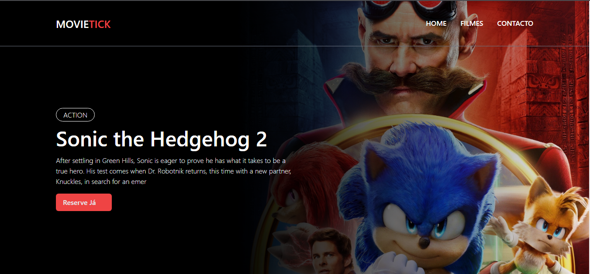

## MOVIETICKET - é um  site para reserva online de bilhetes de cinema. 

##  Layout do projecto

 

## Tecnologias e Ferramentas de Desenvolvimento utilizadas:
# Backend
* PHP 7.4
* Banco de Dados Mysql
* arquitectura de Desenvolvimento MVC
# Frontend
* Materialize
* Tailwind Css
##

## Link para testar o projecto:
* https://movietickets.epizy.com

## Credencial de acesso ao dashboard:
* usuario: lucilio@gmail.com
* senha: 12345

